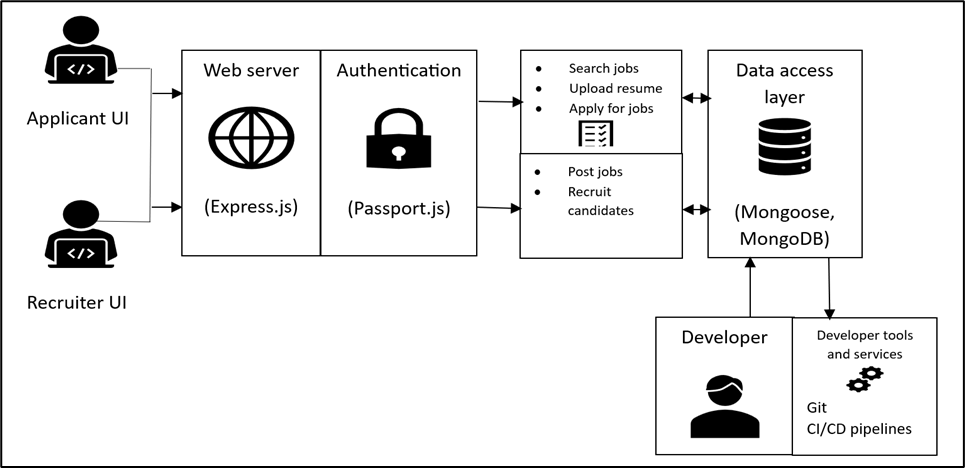

Table of contents:
1.	Introduction
1.1.	What is an e-Recruitment system?
2.	Architecture
3.	e-Recruitment system installation
3.1.	Pre-requisites
3.2.	Edit configuration
3.3.	Deployment
4.	e-Recruitment system usage
1.	Introduction:
e-Recruit is a MERN Stack based web app which helps in streamlining the flow of job application process. It allows users to select their roles (applicant/recruiter) and create an account. In this web app, login sessions are persistent and REST APIs are securely protected by JWT token verification. After logging in, a recruiter can create/delete/update jobs, shortlist/accept/reject applications, view resume and edit profile. And, an applicant can view jobs, perform fuzzy searches with various filters, apply for jobs with an SOP, view applications, upload profile picture, upload resume and edit profile. Hence, it is an all-in-one solution for a job application system.
2.	Architecture:


3.	e-Recruitment system installation
3.1.	Pre-requisites
Frontend Technologies:
HTML, CSS, JavaScript: For building the user interface.
React.js : For creating interactive UI components.
Backend Technologies:
Node.js : A runtime environment to help build the server-side for web applications.
Express.js : A web application framework for Node.js to handle HTTP requests.
Passport.js : for handling authentication.
Database:
MongoDB : A NoSQL database to store data such as user profiles, job listings, and applications.
Mongoose.js : An Object Data Modeling (ODM) library for MongoDB and Node.js.
APIs and Middleware:
JSON Web Tokens (JWT): For secure transmission of information as JSON objects.
Middlewares for logging, error handling, and API request processing.
Development Tools:
Git : For version control.
npm : For managing project dependencies.
3.2.	Edit configuration 
Directory structure of the web app is as follows:
```
- backend/
    - public/
        - profile/
        - resume/
- frontend/
- README.md
```
Cloning the Project
First, you need to clone the eRecruit project repository to your local machine. Open your terminal and run the following command:
```
git clone `https://github.com/Akshadha-ir/Team7_e-recruit.git`
```
3.3.	Deployment 
Instructions for initializing web app:

- Install Node JS, MongoDB in the machine.
- Start MongoDB server: ` sudo service mongod start`
- Move inside backend directory: `cd backend`
- Install dependencies in backend directory: `npm install`
- Start express server: `npm start`
- Backend server will start on port 4444.
- Now go inside frontend directory: `cd ..\frontend`
- Install dependencies in frontend directory: `npm install`
- Start web app's frontend server: `npm start`
- Frontend server will start on port 3000.
- Now open `http://localhost:3000/` and proceed creating jobs and applications by signing up in required categories.
4.	e-Recruitment system usage

Table of Contents
4.1.	Introduction
4.2.	Applicant Object
•	Creating the applicant account
•	Uploading resumes and other documents
•	Applying for jobs
4.3.	Recruiter Object
•	Creating job listings
•	Managing received applications
•	Scheduling interviews
4.4.	Object Access Interface
•	Introduction
•	Interacting with applicant and recruiter objects
4.5.	Example Usage Scripts
•	How to deploy the application
•	How to invoke backend functions
•	Full scripts provided in an HTTP directory
4.6.	Demo

4.1. Introduction
This section provides the example scripts and guidance on how to interact with the e-recruitment platform, demonstrating how to create user accounts, manage job listings, applications, and utilize the Object Access Interface to communicate with the backend system. The example scripts cover the sequence from account creation to the application process for a job.

4.2. Applicant Object
Each applicant object represents a single user on the e-recruitment platform, containing personal information, resumes, and application history.

Creating the Applicant Account
POST http://<your_platform_url>/api/applicants
Content-Type: application/json
json
```
{
  "username": "applicant_username",
  "password": "secure_password",
  "email": "applicant@example.com"
}
```
The server will respond with the details of the new applicant account.

Uploading Resumes and Other Documents
POST `http://<your_platform_url>/api/applicants/<applicant_id>/documents`
Content-Type: multipart/form-data
FormData:
resume: (binary file data)
The server will respond with URLs to access the uploaded documents.

Applying for Jobs
POST `http://<your_platform_url>/api/applicants/<applicant_id>/apply`
Content-Type: application/json
json
```
{
  "jobId": "job_listing_id"
}
```
The server will process the application and update the job's application list.

4.3. Recruiter Object
Each recruiter object represents an HR user or recruiter, capable of creating job listings and managing applications.

Creating Job Listings
POST `http://<your_platform_url>/api/recruiters/<recruiter_id>/jobs`
Content-Type: application/json

json
```
{
  "title": "Job Title",
  "description": "Job Description",
  "requirements": ["requirement1", "requirement2"]
}
```
The server will respond with the details of the new job listing.

Managing Received Applications
GET `http://<your_platform_url>/api/recruiters/<recruiter_id>/jobs/<job_id>/applications`

The server will respond with a list of applications for the specified job listing.

Scheduling Interviews
POST `http://<your_platform_url>/api/recruiters/<recruiter_id>/jobs/<job_id>/schedule`
Content-Type: application/json

json
```
{
  "applicantId": "applicant_id",
  "interviewDate": "YYYY-MM-DDThh:mm:ss"
}
```
The server will confirm the scheduled interview date and notify the applicant.

4.4. Object Access Interface:
Introduction
The Object Access Interface is a RESTful API that enables interaction with the e-recruitment system's objects, such as applicants and job listings. It provides endpoints for creating, retrieving, updating, and deleting data.
4.5. Example Usage Scripts
Scripts for deployment and function invocation are provided in the project's HTTP directory. These scripts include creating classes and functions for both applicants and recruiters and interacting with the backend through REST API calls.

Note: The Object Controller may have an auto generated OpenAPI document which provides detailed API documentation.

Example Scripts:
Deploying the platform using Docker.
Registering a new applicant with a POST request.
A recruiter posting a new job listing.
Uploading a resume to a candidate's profile.
An applicant applying for a job.
Please refer to the HTTP directory for the full example usage scripts and replace the placeholders with your actual platform URL and object IDs as required.

4.6

<video controls src="Demo.mp4" title="Title"></video>
